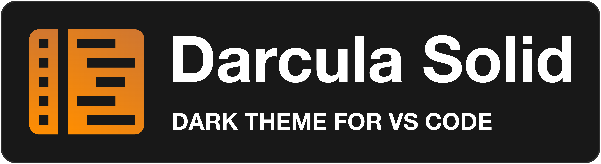
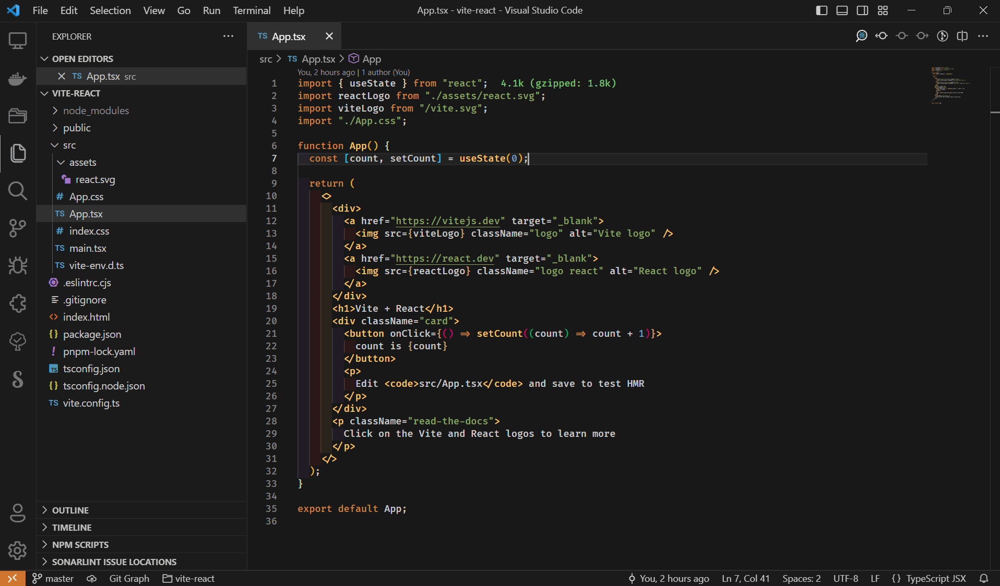

<p>
  <br>
  
</p>



## Getting started

Launch `Quick Open`:

| OS | Shortcut |
| :- | :-       |
|  <a href="https://code.visualstudio.com/shortcuts/keyboard-shortcuts-linux.pdf">Linux</a> | `Ctrl` + `P` |
|  <a href="https://code.visualstudio.com/shortcuts/keyboard-shortcuts-macos.pdf">macOS</a> | `⌘` + `P` |
|  <a href="https://code.visualstudio.com/shortcuts/keyboard-shortcuts-windows.pdf">Windows</a> | `Ctrl` + `P` |

Paste the following command and press `Enter`:

```shell
ext install jussiemion.darcula-solid
```

Select and install Darcula Solid. Then launch `Quick Open`:

| OS | Shortcut |
| :- | :-       |
|  <a href="https://code.visualstudio.com/shortcuts/keyboard-shortcuts-linux.pdf">Linux</a> | `Ctrl` + `Shift` + `P` |
|  <a href="https://code.visualstudio.com/shortcuts/keyboard-shortcuts-macos.pdf">macOS</a> | `⌘` + `Shift` + `P` |
|  <a href="https://code.visualstudio.com/shortcuts/keyboard-shortcuts-windows.pdf">Windows</a> | `Ctrl` + `Shift` + `P` |

Type `theme`, choose `Preferences: Color Theme`, and select Darcula Solid from the list.

## Override theme colors

You can override the Darcula Solid UI and schemes colors by adding these theme-specific settings to your configuration. For advanced customisation please check the [relative section on the VS Code documentation](https://code.visualstudio.com/docs/getstarted/themes#_customizing-a-color-theme).
